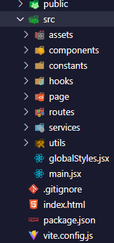
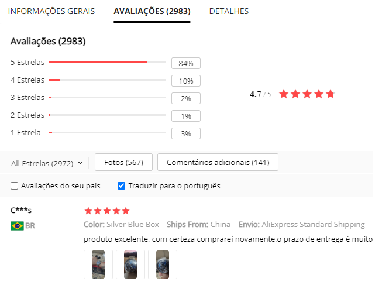
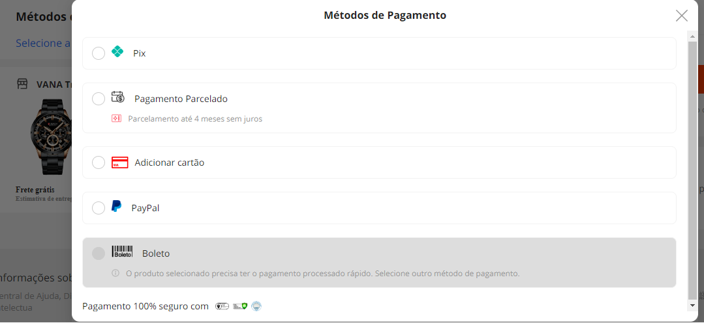

<p></p>

<!-- ABOUT THE PROJECT -->
<h2> :pencil: Sobre o projeto</h2>

<h2 align="justify"> 
Este projeto é um aplicativo de lanchonete completo, desenvolvido com as últimas tecnologias e recursos para tornar a experiência de compra mais fácil e conveniente para os usuários. O aplicativo apresenta categorias de produtos, com uma seção especial para os itens em oferta, além de um sistema de login seguro que utiliza tokens e senhas criptografadas para garantir a segurança dos dados do usuário. Os usuários podem facilmente se cadastrar no aplicativo e personalizar suas informações, incluindo endereços de entrega. Além disso, o aplicativo possui um back-end robusto que permite aos administradores modificar facilmente os produtos disponíveis e atualizar as informações de preço e estoque. Os usuários também podem adicionar itens ao seu carrinho de compras, visualizar o histórico de pedidos e acompanhar o status da entrega. Em resumo, este projeto é uma solução eficiente e segura para os amantes de comida rápida, oferecendo uma ampla variedade de opções de lanches e recursos avançados para uma experiência de compra conveniente e sem problemas.
</h2>

<p></p>

<h2> :books: Organização de pastas</h2>
  
 
<p>
Este projeto é uma aplicação web desenvolvida em React, com uma estrutura de pasta bem organizada e pensada para manter a clareza e a eficiência do código. As pastas incluem Components, que contêm os componentes reutilizáveis da aplicação, Assets, que armazena todos os arquivos estáticos, como imagens e fontes, Constants, que contém constantes usadas em toda a aplicação, Hooks, que armazena todos os hooks customizados da aplicação, Pages, que contém as páginas da aplicação, Routes, que define todas as rotas da aplicação, Services, que contém todas as chamadas à API, Utils, que armazena todas as funções úteis usadas em toda a aplicação, GlobalStyle, que define o estilo global da aplicação, e Main, que é o ponto de entrada da aplicação. A estrutura bem organizada deste projeto garante que o código seja fácil de entender e mantido, e ajuda a garantir a escalabilidade da aplicação à medida que ela cresce.
</p>

<p></p>

<h2> :hamburger: Categorias de produtos / Ofertas :pizza:</h2>


<br>
<p>
Essa página Home é uma página inicial atraente e intuitiva para uma loja virtual. Na página inicial, os usuários podem ver uma lista de categorias de produtos bem organizadas, bem como produtos em oferta destacados. Ao clicar em uma categoria ou produto em oferta, os usuários são redirecionados para uma página dedicada que apresenta mais informações e opções para aquela categoria ou produto específico. Este projeto é projetado para fornecer aos usuários uma navegação fácil e uma experiência de compra agradável, permitindo que eles encontrem rapidamente o que procuram e possam fazer compras com segurança e eficiência.
</p>
<br>


<p></p>
<h2> :woman_technologist: Api </h2>

<p>
Este projeto é uma aplicação back-end que fornece uma conexão entre o front-end e o banco de dados. Ele é responsável por gerenciar e transmitir informações de produtos e usuários para a interface do usuário. Embora o back-end tenha sido criado para ser hospedado, devido à dificuldade e ao custo envolvidos, ele foi executado localmente na máquina do desenvolvedor. Isso permitiu ao desenvolvedor testar e ajustar facilmente o back-end, mas pode afetar a escalabilidade e a disponibilidade da aplicação a longo prazo. No entanto, este projeto ainda fornece uma solução funcional para gerenciar informações de produtos e usuários na aplicação.
</p>

```
import axios from "axios";

const apiCodeBurger = axios.create({
  baseURL: "http://localhost:3001",
});

apiCodeBurger.interceptors.request.use(async (config) => {
  const userData = await localStorage.getItem("codeburger:userData");
  const token = userData && JSON.parse(userData).token;
  config.headers.authorization = `Bearer ${token}`;
  return config;
});

export default apiCodeBurger;
```

<p></p>

<h2> :construction_worker_man: Atualizações</h2>

<p float="left">
  
  
</p>

<p>Nos próximos updates, adicionaremos a funcionalidade de comentários e avaliação por produto. Isso permitirá que os usuários compartilhem suas opiniões e experiências com os produtos oferecidos. Além disso, também incluiremos novas formas de pagamento para garantir ainda mais comodidade aos nossos usuários. Outra novidade será a possibilidade de cadastrar um endereço de entrega e calcular o valor do frete, para que nossos usuários possam ter um orçamento mais preciso antes de finalizar a compra.</p>

<p></p>
